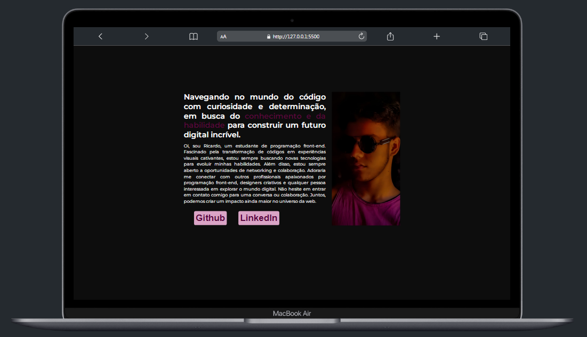

<h1 align="center"> Projeto Cartão de Apresentação </h1>

Um repositório contendo um simples e elegante site de cartão de visita virtual, criado como um projeto pessoal para aprimorar habilidades em desenvolvimento web usando HTML e CSS.

 

  

## 🚀 Tecnologias

Esse projeto foi desenvolvido com as seguintes tecnologias:

- HTML e CSS

---

Feito com ♥ by Ricardo.